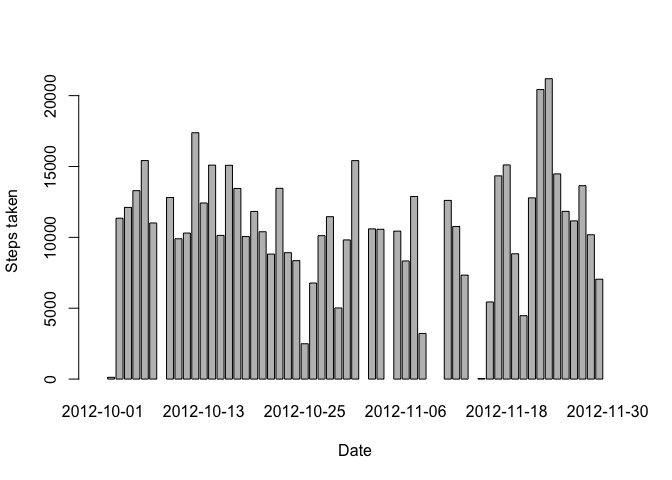
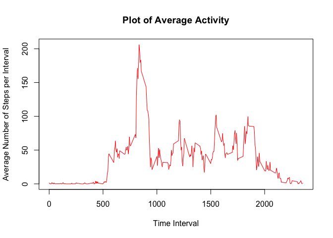
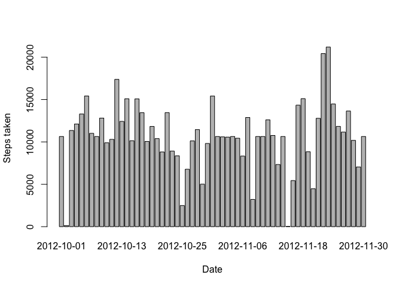
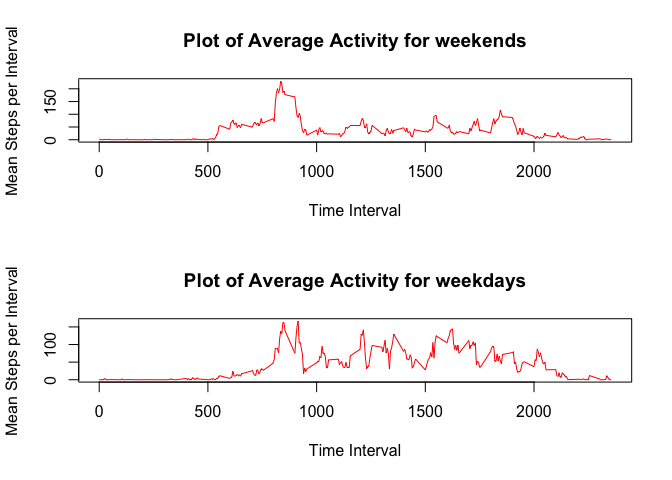

# Reproducible Research: Peer Assessment 1


## Loading and preprocessing the data


```r
require(data.table)
unzip("activity.zip")
data <- as.data.table(read.csv("activity.csv"),na.rm=TRUE)
```


## What is mean total number of steps taken per day?


```r
totalSteps <- data[,list(steps=sum(steps)),by=date]
barplot(totalSteps$steps, names.arg=totalSteps$date,ylab="Steps taken",xlab="Date")
```

 

```r
meanSteps <- mean(totalSteps$steps,na.rm=TRUE)
medianSteps <- median(totalSteps$steps,na.rm=TRUE)
```

The mean number of steps taken is 10766.19 and the median is 10765

## What is the average daily activity pattern?


```r
averageByInterval <- data[,list(steps=mean(steps,na.rm = TRUE)),by=interval]
plot(x=averageByInterval$interval,y=averageByInterval$steps,type="l", main="Plot of Average Activity", xlab="Time Interval", ylab="Average Number of Steps per Interval", col="red")
```

 

```r
maxInterval <- averageByInterval[which(averageByInterval$steps == max(averageByInterval$steps)),interval]
```

The 5-minute interval identifier that contains the maximum number of steps, on average across all days , is 835

## Imputing missing values

### 1. Total number of missing values


```r
missingValues <- data[is.na(steps),]
numberOfMissingValues <- nrow(missingValues)
```

The number of missing values in the dataset is 2304

### 2. Replacing missing values

I try to replace it with the mean for that day, in case that the day is completely empty (all NA's) I replace it with the mean for the interval


```r
replacedData <- data
averageByDate <- data[,list(mean=mean(steps,na.rm=TRUE)),by=date]
for (value in which(is.na(data$steps))) {
  theDate <- data[value, date]
  if (!is.na(averageByDate[date == theDate,mean])) {
    replacedData[value, "steps"] <- averageByDate[date == theDate,mean]
  } else {
    theInterval <- data[value, interval]
    replacedData[value, "steps"] <- averageByInterval[interval == theInterval,steps]
  }
}
replacedTotalSteps <- replacedData[,list(steps=sum(steps)),by=date]
barplot(replacedTotalSteps$steps, names.arg=replacedTotalSteps$date,ylab="Steps taken",xlab="Date")
```

 

```r
replacedMeanSteps <- mean(replacedTotalSteps$steps,na.rm=TRUE)
replacedMedianSteps <- median(replacedTotalSteps$steps,na.rm=TRUE)
```

The new mean is 10749.77 and the new median is 10641. The values decrease in 16.42 and 124 respectively.

## Are there differences in activity patterns between weekdays and weekends?


```r
daytype <- function (x) {
  if ( (x != "Sunday") && (x != "Saturday") ) { 
    result <- "weekday" 
  } else{
    result <- "weekend"
  }
  return(result)
}
replacedData$typeofday <- as.factor(sapply(weekdays(as.Date(replacedData$date)),daytype))
averageByIntervalTypeOfDay <- replacedData[,list(steps=mean(steps,na.rm = TRUE)),by=list(interval,typeofday)]
weekDaysData <- averageByIntervalTypeOfDay[typeofday == "weekday",]
weekEndsData <- averageByIntervalTypeOfDay[typeofday == "weekend",]
par(mfrow=c(2,1))
plot(x=weekDaysData$interval,y=weekDaysData$steps,type="l", main="Plot of Average Activity for weekends", xlab="Time Interval", ylab="Mean Steps per Interval", col="red")
plot(x=weekEndsData$interval,y=weekEndsData$steps,type="l", main="Plot of Average Activity for weekdays", xlab="Time Interval", ylab="Mean Steps per Interval", col="red")
```

 
